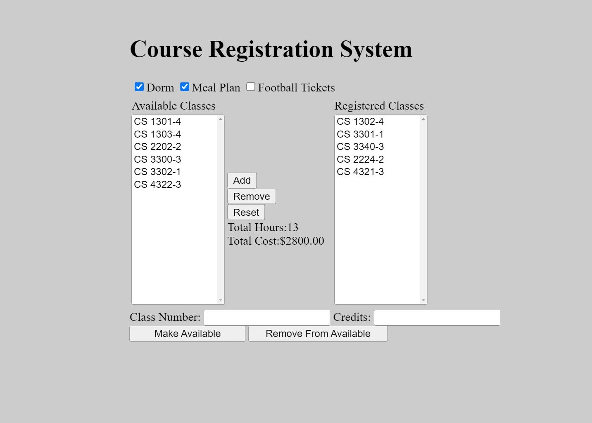

# Course Registration System (2022)

Course registration systems allows students to register for classes, housing, and meal plans. Functions include adding, removing, and creating custom classes.
 
 

